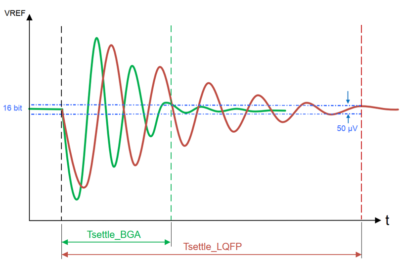

<a name="readme-top"></a>

<br />
<div align="center">
    
  </a>

  <h3 align="center">Quantum Spectrometer</h3>

</div>


<!-- TABLE OF CONTENTS -->
<details>
  <summary>Table of Contents</summary>
  <ol>
    <li>
      <a href="#about-the-project">About The Project</a>
      <ul>
        <li><a href="#background">Background</a></li>
        <li><a href="#goals">Goals</a></li>
      </ul>
    </li>
    <li>
      <a href="#hardware">Hardware</a>
      <ul>
        <li><a href="#main-components">Main Components</a></li>
        <li><a href="#power-supply-and-signal-management">Power Supply and Signal Management</a></li>
          <li><a href="#adc">ADC</a></li>
          <li><a href="#display">Display</a></li>
        <li><a href="#spectrometer-module">Spectrometer Module</a></li>
      </ul>
    </li>
    <li>
      <a href="#software">Software</a>
      <ul>
        <li><a href="#signal-generation">Signal Generation</a></li>
        <li><a href="#display">Display</a></li>
        <li><a href="#user-interface">User Interface</a></li>
      </ul>
    </li>
     <li>
      <a href="#calibration">Calibration</a>
      <ul>
        <li><a href="#spectral-response">Spectral response</a></li>
        <li><a href="#wavelength-calibration">Wavelength Calibration</a></li>
        <li><a href="#absolute-response-calibration">Absolute response calibration</a></li>
        <li><a href="#timing-and-adc-measurement">Timing and ADC Measurement</a></li>
      </ul>
    </li>
     <li>
      <a href="#conclusions">Conclusions</a>
    </li>
  </ol>
</details>

# About The Project

## Background
Quantum spectrometers are crucial tools used by plant growers, researchers, and lamp manufacturers to measure and optimize light composition. By adjusting the intensity of different wavelengths, it is possible to influence various plant characteristics, such as chemical composition and growth rate.

### Key Concepts

- **PPFD (Photosynthetic Photon Flux Density):** Measures the number of photosynthetically active photons falling on a surface per second, expressed in $\frac{\mu mol}{m^2s}$.
- **PPF (Photosynthetic Photon Flux):** Total number of photons released from a light source within the PAR range.
- **PFD (Photon Flux Density):** Covers the spectrum beyond PAR.
- **PAR (Photosynthetically Active Radiation):** Wavelength range from 400nm to 700nm, essential for photosynthesis.

<div align="center">
    
    </a>
</div>
## Goals
The project aims to design and build a spectrometer capable of measuring the quality and quantity of light within the PAR spectrum, aiding in the design of better LED lamps for planted aquariums.
### Implemented Features
- Single measurement
- Continuous measurement
- Exposure time adjustment
- Spectral corrections
- Signal averaging
- PPFD measurement
- Peak measurements

### Pending Features
- Colour Rendering Index
- Illuminance (LUX) measurement
- Correlated Colour Temperature (CCT)
- Data export
- Natural Density Filter
- CIE Chromaticity Coordinates
- Cosine corrected diffuser

<p align="right">(<a href="#readme-top">back to top</a>)</p>


# Hardware
## Main Components
- **Microcontroller:** STM32h7a3zi based on Cortex-M7 architecture with 2 Mbytes flash memory, 1376 KB SRAM, and a 280 MHz CPU.
- **Voltage Regulators:** Two regulators, one delivering 7V to the Op-Amp and the other supplying the C12880MA module and STM32 development board.
- **Op-Amps:** Used for signal buffering and voltage attenuation.

STM32 development board, with additional prototyping PCB and a breadboard was used for testing and measurements. 
<div align="center">
    
    </a>
</div>

## Power Supply and Signal Management

The system is powered by a 9V battery with two voltage regulators. An analog 5V to 3.3V attenuator is used due to the STM32's ADC module's 3.3V maximum input.
C12880MA has an output impedance 150Ω. A buffer is used as increased current consumption at video output could result in higher dark current.
Another buffer is added before delivering video signal to ADC. An Op-Amp working as follower was added. STM32 has two Op-Amps embedded. Unfortunately, it was not possible to use both without scarifying performance. The output of embedded Op-Amp I connected internally to the ADC unit. To increase the accuracy, internal voltage reference is replaced with 3.3V external reference.
<div align="center">
    
    </a>
</div>
## ADC
For this application, Successive-Approximation (SAR)) converter is a better option, because it allows for a higher dynamic range. That is desired for PPFD measurement. The maximum sampling rate available for direct channels with the 16-bit resolution is 3.60 MSPS. By lowering the resolution to 14-bit it is possible to achieve 5.0 MSPS.

## Display
- **TFT Display:** Generic no-name model with ILI9341 driver for the display and XPT2046 driver for the touchpad, communicating via SPI.
- **Display Performance:** Utilizes DMA for better performance, with a screen refresh rate optimized to 14.242 Hz.

## Spectrometer module
The spectrometer module is compact and measures light within the 340-850 nm spectrum, with 288 pixels and a typical resolution of 12-15 nm. The specific unit used has a resolution of 8.8 nm according to the provided calibration sheet. 
The module has a slit size of 50x500 μm, and the aperture is fixed. It is in hermetically sealed packaging, therefore there should be no need for recalibration, and it has a high reliability against humidity.

<p align="right">(<a href="#readme-top">back to top</a>)</p>

# Software
Most tasks run in the background using interrupts. The main function handles display updates.
<div align="center">
    
    </a>
</div>
## Signal generation
Timers are used to generate signal patterns for controlling integration time and ADC conversion. The integration time and ADC sampling are calibrated for optimal performance using multiple PWM channels and timers.

When the user initiates the measurement process, it begins with timer initialization. TIM4, functioning as the master, generates a 1 MHz clock signal for the spectrometer. Two channels are utilized:
- PWM Channel 1
 - Output compare Channel 2

The PWM signal serves as the main clock. The Output Compare unit, however, does not start with the PWM; it is triggered by TIM2. An offset is added to this channel for calibrating ADC data conversion, ensuring the highest accuracy when ADC sampling starts and finishes around the middle of the pulse. This was measured and adjusted using an oscilloscope.

TIM2 operates as a slave to TIM4 in External Clock Mode 1. When triggered by TIM4, it starts two PWM signals:
- PWM Channel 1
- PWM Channel 2

The first PWM signal generates the ST signal high period, the duration of which depends on the user-set exposure time. The PWM signal on channel two measures the time required by the C12880MA for the low period of ST. Upon overflow, it triggers the Output Compare module on TIM4 to start, which in turn initiates the ADC conversion. Once conversion begins, the ADC callback is triggered, stopping the ADC trigger (TIM4 OC), clearing the interrupt flag, and checking for any conditions preventing the completion of the measurement. If none are found, it calls the refresh function, updating the x-axis of the chart with new values.

The ADC uses DMA to transfer data to memory. After the transfer, the data undergoes filtering, conversion, and interpretation, which requires significant resources. To expedite this process, data collection occurs after the conversion of the first 144 pixels and then again after 288 pixels. This is possible because the DMA can be configured to trigger a callback after half of the data transfer. This mode is only functional when averaging is turned off.
<div align="center">
    
    </a>
</div>
## Display
The SPI clock is set to 140MHz and then divided by 8 with a prescaler. That gives the baud rate of 17.5 MBits/s. It was possible to go up to 50 MBits/s, but it is not necessary as there are no animations etc. 

The total buffer size is 15kB, and the screen can be flushed with a double buffer as the microcontroller has 2 Mbytes of flash and 1376 KB SRAM memory. Each pixels takes two bytes per pixel.
$$320 \cdot 240 \cdot 2 = 153600$$
$$153600 \cdot 8 \ \text{bits}=1228800$$
Dividing by the SPI baud rate gives the time SPI needs to transfer one frame buffer:
$$\frac{1228800}{17.5\ \text{MHz}}=70.217\ \text{ms}$$
The refresh time must be slower than 70.217ms:
$$\frac{1}{70.217\ \text{ms}}=14.242 \ \text{Hz}$$
For syncing the display, Timer8 is used.  It is configured to provide a call every 5 ms:
$$\frac{280\ \text{MHz}}{ 280\ \text{(prescaler)}}=1\ \text{MHz}$$
$$\frac{1\ \text{MHz}}{5000}=200\ \text{Hz}$$


## User Interface
The user interface, created with the LVGL library, allows for simple operation and displays measurement charts. Users can adjust integration time, turn on averaging, and choose measurement modes.
<div align="center">
    
    </a>
</div>
<div align="center">
    
    </a>
</div>
# Calibration
C12880MA calibration involves three main steps:
- **Wavelength Calibration:** Converts image sensor pixel numbers to wavelengths using a polynomial equation.
- **Relative Spectral Response Correction:** Adjusts for non-uniform spectral sensitivity of the C12880MA module.
- **Absolute Response Calibration:** Requires a homogeneous light entry system (e.g., integrating sphere, diffuser) for precise calibration.
## Spectral response
The C12880MA's spectral response is not flat and has lower sensitivity around 800 nm. Calibration data is used to correct for these variations.
<div align="center">
    
    </a>
</div>
The calibration data for spectral response:
| **Wavelength [nm]** | **Typical** | **Actual**  | **Normalized** |
| ------------------- | ----------- | ----------- | -------------- |
| 340                 | 3.55113E+16 | 4.45406E+16 | 646.57         |
| 400                 | 6.45865E+16 | 6.37594E+16 | 979.09         |
| 450                 | 5.95577E+16 | 6.49682E+16 | 1000.00        |
| 500                 | 5.70242E+16 | 4.73677E+16 | 695.48         |
| 550                 | 4.86027E+16 | 4.33414E+16 | 625.82         |
| 600                 | 4.85998E+16 | 4.23545E+16 | 608.75         |
| 655                 | 4.21444E+16 | 3.50606E+16 | 482.55         |
| 710                 | 2.91744E+16 | 2.57983E+16 | 322.30         |
| 760                 | 2.09780E+16 | 1.95138E+16 | 213.57         |
| 810                 | 1.31647E+16 | 1.16520E+16 | 77.55          |
| 850                 | 8.04830E+15 | 7.16979E+15 | 0.00           |

The arbitrary values were normalized and plotted on a chart. The data set was interpolated in MS Excel. 
For interpolating the data set, a forecast inner-linear interpolation was used. The Excel formula used:
```xls
=MATCH(D31,A9:A19,1)
=INDEX(A9:A19,MATCH(D31,A9:A19,1))
=INDEX(A9:A19,MATCH(D31,A9:A19,1)):INDEX(A9:A19,MATCH(D31,A9:A19,1)+1)
=FORECAST(D31,INDEX(A9:A19,MATCH(D31,A9:A19,1)):INDEX(A9:A19,MATCH(D31,A9:A19,1)+1),IN
DEX(A9:A19,MATCH(D31,A9:A19,1)):INDEX(A9:A19,MATCH(D31,A9:A19,1)+1))
ALL:
=FORECAST(D31,
INDEX(C9:C19,MATCH(D31,A9:A19,1)):INDEX(C9:C19,MATCH(D31,A9:A19,1)+1),
INDEX(A9:A19,MATCH(D31,A9:A19,1)):INDEX(A9:A19,MATCH(D31,A9:A19,1)+1))
```
All the values were normalized and saved as an array.
```c
/* data imported from Excel. 100% sensitivity happens at 54th pixel, at
448.4nm*/
const float sensitivity_percent [288]= {
/* very low sensitivity at the far right spectrum. Changed to a
small value, unless needed. */
1.52, 1.52, 1.52, 1.52, 1.52, 1.52, 1.52, 1.52, 1.52, 1.52, 1.52,
1.52, 1.52, 1.49, 1.46, 1.43, 1.40, 1.37, 1.34, 1.32,
1.29, 1.27, 1.24, 1.22, 1.20, 1.18, 1.16, 1.14, 1.12, 1.10, 1.09,
1.07, 1.05, 1.04, 1.02, 1.02, 1.02, 1.02, 1.02, 1.02,
1.01, 1.01, 1.01, 1.01, 1.01, 1.01, 1.01, 1.01, 1.01, 1.00, 1.00,
1.00, 1.00, 1.00, 1.01, 1.02, 1.04, 1.05, 1.07, 1.09,
1.11, 1.13, 1.15, 1.17, 1.19, 1.21, 1.23, 1.25, 1.28, 1.30, 1.33,
1.35, 1.38, 1.41, 1.44, 1.45, 1.45, 1.46, 1.47, 1.47,
1.48, 1.49, 1.50, 1.50, 1.51, 1.52, 1.53, 1.53, 1.54, 1.55, 1.56,
1.57, 1.57, 1.58, 1.59, 1.60, 1.60, 1.60, 1.60, 1.61,
1.61, 1.61, 1.61, 1.61, 1.62, 1.62, 1.62, 1.62, 1.62, 1.63, 1.63,
1.63, 1.63, 1.63, 1.64, 1.64, 1.64, 1.64, 1.65, 1.67,
1.68, 1.69, 1.71, 1.72, 1.74, 1.75, 1.77, 1.78, 1.80, 1.81, 1.83,
1.85, 1.86, 1.88, 1.90, 1.91, 1.93, 1.95, 1.97, 1.99,
2.00, 2.02, 2.04, 2.06, 2.08, 2.11, 2.14, 2.16, 2.19, 2.22, 2.25,
2.28, 2.31, 2.34, 2.37, 2.40, 2.43, 2.47, 2.50, 2.54,
2.57, 2.61, 2.65, 2.69, 2.73, 2.77, 2.81, 2.86, 2.90, 2.95, 3.00,
3.04, 3.10, 3.14, 3.18, 3.22, 3.26, 3.30, 3.34, 3.39,
3.43, 3.48, 3.52, 3.57, 3.62, 3.67, 3.72, 3.78, 3.83, 3.89, 3.95,
4.01, 4.07, 4.13, 4.19, 4.26, 4.32, 4.39, 4.47, 4.54,
4.61, 4.69, 4.79, 4.90, 5.01, 5.12, 5.24, 5.36, 5.49, 5.63, 5.77,
5.92, 6.07, 6.23, 6.40, 6.58, 6.77, 6.97, 7.18, 7.41,
7.64, 7.89, 8.16, 8.45, 8.75, 9.08, 9.43, 9.80, 10.21, 10.64,
11.12, 11.64, 12.20, 12.83, 13.33, 13.85, 14.41, 15.01,
15.66, 16.37, 17.14, 17.99, 18.92, 19.94, 21.08, 22.36, 23.79,
25.41, 27.26, 29.39, 31.87, 34.79, 38.29, 42.56, 47.87,
54.68, 63.69, 76.20, 94.74, 125.06, 183.58, 343.88, 2642.75,
2642.75, 2642.75, 2642.75, 2642.75, 2642.75, 2642.75,
2642.75, 2642.75, 2642.75, 2642.75, 2642.75, 2642.75, 2642.75,
2642.75, 2642.75, 2642.75, 2642.75, 2642.75, 2642.75,
2642.75, 2642.75, 2642.75, 2642.75, 2642.75, 2642.75
};
```
The MS Excel sheet can be found in assets folder.

## Wavelength calibration
The C12880MA sensor consists of 288 pixels, each corresponding to a specific wavelength. These wavelengths are calculated using the formula provided by the sensor manufacturer, which includes a conversion factor for translating the image sensor pixel number into wavelengths. Calibration coefficients were determined at the following wavelengths: 340 nm, 400 nm, 450 nm, 500 nm, 550 nm, 600 nm, 655 nm, 710 nm, 760 nm, 810 nm, and 850 nm.

$$Wavelength[nm] = A_{0} + B_{1} × pix + B_{2} × pix^2 + B_{3} × pix^3 + B_{4} × pix^4 + B_{5} × pix^5$$

The values are calculated before measurements can begin and do not need to be recalculated for every measurement since they remain constant. Therefore, the function shown below needs to be used only once. Subsequently, the charts are updated only with the y values.
```c
float wavelength(uint16_t pix){
	uint16_t nm = (3.068537876*pow(10,2) + 2.70082964998025 * pix -
	1.062891037*pow(10,-3) * pow(pix,2)
	- 8.375289840*pow(10,-6) * pow(pix,3) + 1.175669178*pow(10,-8)
	* pow(pix,4)
	+ 1.798047227*pow(10,-12) * pow(pix,5))*10;
	float wavelength = nm/10.0;
}
return wavelength;
```

## Absolute response calibration
Absolute power calibration is effective in systems with homogenous light entry, such as those using an integrating sphere or a diffuser, which the micro spectrometer lacks. Simply directing the spectrometer towards light is insufficient, as results would vary with slight changes in position or angle. To address this issue, a cosine-corrected diffuser is required.

The easiest way to achieve absolute calibration is to use either an absolutely calibrated diffused light source (calibrated light source with an integrating sphere) or a calibrated measurement device (calibrated spectrometer). In the latter case, a diffuser is necessary. The next step involves measuring the light source with the spectrometer needing calibration. This allows for creating adjustments; a simple factor is enough since the relative spectrum response is already obtained.
## Timing and ADC Measurement
The spectrometer operates at a maximum frequency of 5 MHz, with an integration time determined by the high period of the start pulse and additional clock pulses. The ADC module's sampling rate and resolution are optimized for the spectrometer's output rate.
<div align="center">
    
    </a>
</div>
 The minimum clock cycles for ST signal high period is $6/f(clk)$. The low period of ST signal is $375/f$. The minimum integrating time is $10.8{\mu s}$. It is because the integrating time is related to the clock speed. The higher the clock speed the higher the dynamic range. To measure high intensities of light it is required to keep the clock high. For the 1 MHz clock the minimum integration time is $54{\mu s}$. The video signal is acquired at the rising edge of the 89th TRG pulse. For this project that signal is not used. Instead, the timing is based on the `clk` generated by the microcontroller, with the additional offset.

Calculations for 5MHz clock:
$$\frac{381}{f}=\frac{381}{5MHz}=76.2\mu s\frac{375}{f}$$
$$\frac{375}{f}=\frac{375}{5MHz}=75\mu s$$
$$76.2\mu s-75\mu s=1.2\mu s$$
The integration time is the sum of the high period time of the start pulse and 48 clock pulses:
$$1.2\mu s+\left( 48\cdot \frac{1}{5MHz} \right)=10.8\mu s$$


The ADC module requires minimum $1.5_{\text{ADC CLK}}$ for sample period. Then the number of clocks required for conversion depend on the resolution.

| **Resolution** | **Conversion (t)** |
| -------------- | ------------------ |
| 16 bits        | 8.5 Cycles         |
| 14 bits        | 7.5 Cycles         |
| 12 bits        | 6.5 Cycles         |
| 10 bits        | 5.5 Cycles         |
| 8 bits         | 4.5 Cycles         |

For this project chosen ADC clock is 36 MHz, and 12-bit/14-bit resolution.
Conversion speed for 12-bit resolution:
$$T_{conv}=sampling\_time+7.5$$
$$(6.5+1.5)\cdot{\frac{1}{36 \ MHz}}=222.2 \ ns$$
Conversion speed for 14-bit resolution:
$$(7.5+1.5)\cdot{\frac{1}{36 \ MHz}}=250 \ ns$$
The data from the C12800MA is transmitted at a 1 MHz rate, corresponding to 1 µs per data point. Given that 250 ns is only ¼ of the data transfer rate, it is feasible to increase the sampling time to  $2.5_{clock \_cycles}$, resulting in a sampling time of 277.7 ns.

$$(7.5+2.5)\cdot \frac{1}{36_{MHz}}=277.7ns$$

<div align="center">
    
    </a>
</div>

<p align="right">(<a href="#readme-top">back to top</a>)</p>

# Conclusions
This project resulted in successfully designed a quantum spectrometer for measuring light within the PAR spectrum. The device helps in optimizing LED lamps for planted aquariums by providing accurate and reliable light measurements. Future improvements include implementing pending features and enhancing calibration methods for greater accuracy and functionality.

**Light intensity measurement and conversion to PPFD** </br>
To measure the light intensity of different sources, a spectrometer needs to have a high dynamic range. However, the C12880MA used in this project does not possess a high dynamic range. Although the slit width cannot be adjusted, the integration time can be varied, albeit with limitations on how short the integration time can be. Another solution is to use a neutral density (ND) filter, but this requires manually placing physical filters when the ADC output becomes saturated.

**ADC**</br>
It was later discovered that the maximum sampling rate for the ADC specified by the manufacturer is only valid for BGA packaging. The settling time for LQFP compared to BGA is much longer due to the parasitic inductance added by the LQFP package on the VREF pin. The performance could be improved with a BGA package and a well-designed PCB.
<div align="center">
    
    </a>
</div>
<p align="right">(<a href="#readme-top">back to top</a>)</p>


